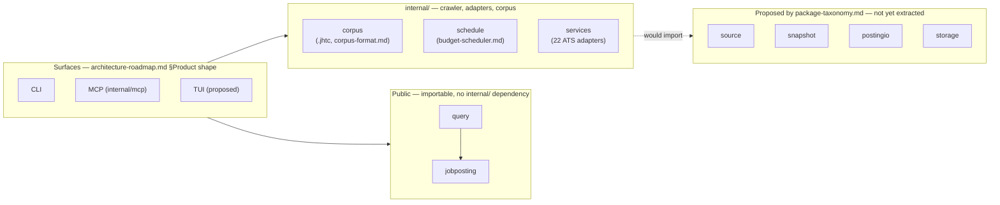

# Design docs

Each file below argues one decision from measurements — a prototype in
`scratchpad/`, a real manifest, a benchmark against this tree — rather than from
preference. [`../architecture-roadmap.md`](../architecture-roadmap.md) is the
front door: it lays out the product shape and delivery phases these documents
feed. Read that first; come here for the "why" behind a specific one.

| File | Decides | Status |
| --- | --- | --- |
| [`storage-engine.md`](storage-engine.md) | Corpus storage: a stdlib-only columnar file over SQLite or Parquet | Implemented — [`internal/corpus`](../../internal/corpus) |
| [`corpus-format.md`](corpus-format.md) | Posting identity, absence, and the `.jhtc` on-disk layout | Implemented — [`internal/corpus`](../../internal/corpus) |
| [`budget-scheduler.md`](budget-scheduler.md) | Spending a time budget across sources by measured cost, not source count | Implemented — [`internal/schedule`](../../internal/schedule) |
| [`index-and-query.md`](index-and-query.md) | The query language's cost model, ordering, and a proposed `index` command | Query language shipped ([`query`](../../query)); indexing/pagination proposed |
| [`package-taxonomy.md`](package-taxonomy.md) | Which packages become public, and where they live in the module | Partially done — see `public-api-extraction.md` |
| [`public-api-extraction.md`](public-api-extraction.md) | Status record for the taxonomy: what's extracted so far | Living status doc |

## Where the decisions land

Solid arrows are real imports today; the dashed one is what
`package-taxonomy.md` proposes next. `jobposting` and `query` already import
nothing outside the standard library plus each other —
`TestDependenciesAreStandardLibraryOnly` enforces it.

## Provenance

Produced 2026-07-28 by research against this tree: real crawl manifests,
`scratchpad/` prototypes, and `go build`/`go list` measurements of the actual
module graph. Numbers that aren't measured are labelled as assumptions where
they appear — see each file's "What this design rests on" section.
