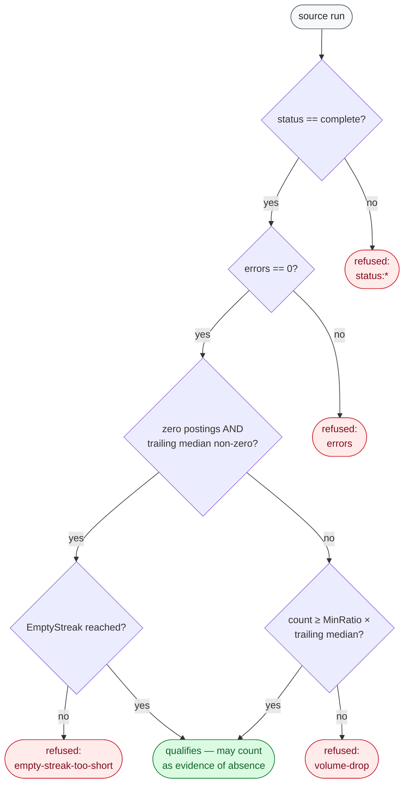
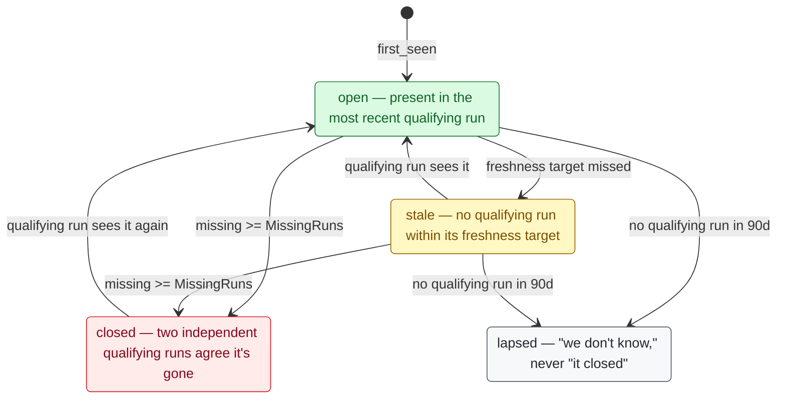
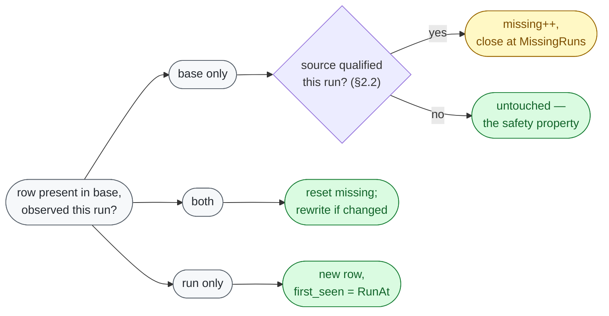

# The corpus format

> **Status: implemented** — [`internal/corpus`](../../internal/corpus)
> (identity in `identity.go`, the closure rule in `closure.go`, `Apply` in
> `apply.go`, the `.jhtc` container in `table.go`).

`docs/crawl-budget-model.md` replaces "did the crawl finish?" with "how stale is
each source?", and that question has no answer until postings persist across
runs. Today a run emits `postings.ndjson` plus a manifest and forgets both, and
`jobs_record.txt` keeps one integer per day. This document specifies the thing
in between: a versioned, append-friendly record of postings over time that a
CLI, a GitHub Actions job, a daemon and a browser tab can all read.

It is a format and an algorithm, not a database. Nothing here is required by the
crawler; `postings`, `total` and `health` keep working with no corpus at all, as
`docs/architecture-roadmap.md` requires.

## What this design rests on

Everything below is measured. Prototypes live in the scratchpad, not the repo.

**Real posting data.** 31,473 postings pulled from live boards today across 19
platforms, in two runs (`postings --json --company=…`), stored as
`scratchpad/all.ndjson`. Used for identity coverage and record sizing.

**The real 07/28 crawl manifest** (`scratchpad/measure-manifest.json`), the one
`docs/measurements/2026-07-28-crawl.md` reports: 3,685 sources, 840,732 raw
postings, 780,489 after deduplication (7.2% duplicates), 3,675 complete, 8
failed, 2 truncated. Used for layout, sizing and the closure rule.

**`scratchpad/corpusproto`** — writes 780,489 corpus rows built by replicating
the real sample, and measures encoding, compression, block indexing, range
decoding, scan and merge.

**`scratchpad/closureproto`** — the closure rule, run against the real manifest.

**`scratchpad/pqcheck`, `scratchpad/sqcheck`** — dependency and portability
probes for the two formats this design rejects.

Numbers that are *not* measured are labelled as assumptions where they appear.
The largest of them is posting churn, which needs two consecutive runs and does
not have them yet.

---

## 1. Identity

### 1.1 The problem, in the data

`internal.Dedupe` and `shard.DedupeIdentity` key on URL, falling back to
company+title+location. That is correct for a snapshot — it answers "how many
distinct openings did this run see?" — and wrong for a corpus, for three reasons
visible in today's sample:

- **A URL can change while the posting does not.** Greenhouse moved boards from
  `boards.greenhouse.io` to `job-boards.greenhouse.io`; every URL in the sample
  is on the new host. Teamtailor's URLs embed the title
  (`/jobs/8026569-educatrice-de-jeunes-enfants-halte-garderie-…`) and Recruitee's
  are a title slug with no id at all (`/o/surgeonmedical-officer`). An edited
  title on either platform is a new URL, and URL-keyed identity would report a
  close and a fresh opening for a typo fix.
- **A URL can be stable while identity is ambiguous.** Two Greenhouse slugs for
  one employer publish the same absolute URL. That is the case `shard merge`
  already deduplicates and must keep deduplicating.
- **The strongest key is not universally present.** `ExternalID` — the ATS's own
  posting id — is populated on 17 of the 19 platforms in the sample, at 100%
  coverage within each. It is **absent on `jibe` and `workday`**, which
  contributed 377,855 of the 840,732 raw postings in the 07/28 run: **45% of the
  corpus has no external id today.** (Coverage was checked on 2 sources per
  platform; treat per-platform coverage as strong evidence, not a census.)

`RequisitionID` looks like a substitute and is not one. Measured on the same
sample:

| source | postings | distinct requisition ids | worst collision |
| --- | ---: | ---: | --- |
| greenhouse/stripe | 532 | 2 | literal `See Opening ID` on 531 rows |
| greenhouse/cloudflare | 275 | 107 | `834` on 4 rows |
| greenhouse/databricks | 800 | 618 | 86 ids reused |
| workday/3m | 666 | 666 | none |
| workday/adobe | 834 | 834 | none |

A requisition is an employer's internal reference, and employers post one
requisition to several locations. It is exactly the field a human wants in a
referral email and exactly the field that must never be identity — but it *is*
unique inside both Workday tenants tested, which is the 45%-coverage gap it
could close. The rule below lets it be used where it is provably safe and
nowhere else.

### 1.2 The rule

A corpus posting is identified by **the integration it came through plus the
most specific stable key that integration published**. Two observations are the
same posting when their `ID`s match.

```
ID = sha256( "jht-corpus-id-v1" ‖ 0x00 ‖ platform ‖ 0x00 ‖ key ‖ 0x00 ‖ basis ‖ 0x00 ‖ value )[:16]
```

`basis` and `value` come from a fixed ladder, highest first:

| basis | value | used when |
| --- | --- | --- |
| `external` | `ExternalID` | non-empty, and unique within the source in this run |
| `requisition` | `RequisitionID` | non-empty, **unique within the source in this run**, and the source has never seen a requisition collision |
| `url` | normalized URL | non-empty, and unique within the source in this run |
| `descriptor` | `sha256(title ‖ 0x00 ‖ location)` | last resort |

Three properties make this work.

**Identity is scoped to the integration, never global.** `platform + key` is
already the project's stable integration ID
(`docs/architecture-roadmap.md`), and scoping identity to it is what makes
per-source closure sound: a row can only ever be closed by evidence from the one
source that produced it. A global key would let a Greenhouse failure reason
about an Ashby row. It also means an employer on two ATSs has two rows, which is
the truth — two applications, two URLs, two closing dates.

**A candidate that collides is demoted, within the run that observed the
collision.** Before writing, the applier groups the run's postings by source and
checks each ladder rung for duplicates. Stripe's `See Opening ID` collides 531
ways, so `requisition` is demoted for that source and `external` (present on
Greenhouse) is used instead; had Greenhouse published nothing, it would fall to
`url`. This is one pass over a source's rows, deterministic, and needs no
per-platform table — the same reason `shard`'s affinity is derived from
`httpx`'s policy table rather than curated beside it. A source that has ever
demoted `requisition` records `requisition_unsafe: true` in its state and never
promotes it again, so a lucky day cannot re-promote a field that collided
yesterday.

**Identity never contains an observation.** Title, location, department,
compensation and workplace type are values a board edits in place. They live in
the row's `posting` object and can change without ending the row's life. Only
`descriptor` identity — the last resort, reached only when a board publishes
neither an id nor a URL — is content-derived, and rows on that basis carry the
basis in the file so a consumer can distrust them.

**URL normalization** (used only for the `url` basis) is deliberately timid:
lowercase scheme and host, drop the fragment, drop a fixed allowlist of tracking
parameters (`gh_src`, `gh_jid`, `utm_*`, `source`, `ref`, `src`), sort the
remaining query parameters, strip a trailing slash. Nothing else. Dropping an
unknown parameter is how you merge two real postings into one; the allowlist is
in `corpus/url.go` with a test per entry.

### 1.3 What identity deliberately does not solve

**The same role through two ATSs.** A company on Greenhouse and Ashby publishes
two postings with different ids and different URLs, and this format keeps both.
Every row carries `dedupe_key`, byte-identical to `shard.PostingKey` (SHA-256 of
`internal.Dedupe`'s identity, truncated to 16 bytes), so the corpus's headline
count is the count of distinct `dedupe_key` among non-closed rows — the same
global union `shard merge` computes today, unchanged. That catches same-URL
duplicates and nothing more.

Genuine cross-ATS duplicates need a curated company identity, which is what
`internal/enrich` is building and what the roadmap means by "a separately
curated company ID can outlive moves from Greenhouse to Ashby". Until that
exists, the corpus may carry an **advisory** `cluster_key =
sha256(employer_id ‖ squash(title) ‖ squash(location))`, populated only for
sources with a resolved employer, and it is used for UI grouping only. It must
never feed closure and must never feed the headline count: one employer with 40
openings titled "Software Engineer" in "Remote" would collapse to one.

**A source that changes its key.** A company that renames its Greenhouse slug
changes `key`, therefore changes every `ID`, therefore closes a board and opens
an identical one. Handled by a curated `corpus/aliases.tsv` mapping old
`platform+key` to new, applied at the top of `Apply`, in the same reviewed-table
spirit as `internal/enrich`. Small, auditable, and honest about being manual.

---

## 2. Absence: how "closed" is derived

This is the part that can destroy the corpus, so it is the part with the
narrowest rule.

### 2.1 The measured hazard

From the real 07/28 manifest:

- **2 sources ended `truncated`, holding 177,296 postings** — `jibe/fedex`
  (103,196) and `jibe/dollargeneral` (74,100). That is **21.1% of the run's raw
  output in two rows of the manifest.** A rule that closed anything absent from
  the latest run would have closed most of two of the largest employers in the
  registry the first time the crawl hit its deadline mid-source. Under the budget
  model, hitting a deadline mid-source is the *designed* behaviour.
- **174 sources returned zero postings, and 166 of them reported status
  `complete`.** A complete-and-empty run is indistinguishable, from the outside,
  between "this company is not hiring" and "the adapter's pagination broke on a
  response shape it has not seen". `health` already draws that distinction as
  `empty` vs `failed` for exactly this reason.
- 8 sources ended `failed`, 7 of them Workday tenants with the same
  `workdayStatusError` — a correlated platform-side event, not 8 companies
  simultaneously withdrawing every job.

### 2.2 The rule

> A posting may be marked missing only by a **qualifying observation of its own
> source**. Absence from the corpus, from a run, or from any other source is not
> evidence of anything.

A source run qualifies when all of the following hold:

1. `status == "complete"`. `truncated`, `stopped`, `failed` and `planned` never
   qualify. (`internal/services/observe.go` already sets `failed` whenever
   `Errors > 0`, so condition 2 is belt-and-braces against a future adapter that
   swallows errors.)
2. `errors == 0`.
3. If the run returned **zero** postings and the source's trailing median is
   non-zero, it qualifies only after `EmptyStreak` consecutive qualifying-shaped
   empty runs (default 3).
4. If the run returned fewer than `MinRatio` of the source's trailing median
   count (default 0.25), it does not qualify. This is the pagination-broke and
   partial-page cases, and it is the same guard the roadmap wants moved out of
   `MAX_FAILED_SOURCE_PCT` in YAML and into Go, applied per source instead of
   per run.

A posting absent from a qualifying run gets `missing++`. It is closed when
`missing >= MissingRuns` (default 2) — two independent qualifying runs must
agree before a row's life ends. Any observation resets `missing` to 0.

```go
// Policy holds every tunable that can end a posting's life. All four defaults
// are deliberately conservative: a delayed close is a cosmetic error, and a
// wrong close destroys history that cannot be recovered by re-crawling.
type Policy struct {
	EmptyStreak int     // qualifying empty runs before an empty run may close  (3)
	MinRatio    float64 // fraction of trailing median a run must reach         (0.25)
	MissingRuns int     // qualifying runs a posting must be absent from        (2)
	LapseAfter  time.Duration // no qualifying run for this long -> Lapsed      (90 * 24h)
}

// Verdict is why a run may or may not be used as evidence of absence.
type Verdict struct {
	Qualifies bool
	Reason    string // "ok", "status:truncated", "errors", "empty-streak-too-short", "volume-drop"
}

// Qualifies is the only place in the codebase permitted to decide that a source
// run counts as evidence a posting is gone.
func Qualifies(run services.SourceRun, st SourceState, p Policy) Verdict
```



Run against the real manifest, `closureproto` reports the rule refusing
**176 of 3,685 source runs**: 2 for `status:truncated` (the 177,296 postings
above), 8 for `status:failed`, and 166 for `empty-streak-too-short`. Every other
source run qualifies and closure proceeds normally. The guard costs 4.8% of
source runs one cycle of latency and protects a fifth of the corpus.

### 2.3 Four states, not two

Under a budget model most sources are not visited in most runs, so "not closed"
cannot mean "open".

| state | definition |
| --- | --- |
| `open` | present in the source's most recent qualifying run |
| `stale` | the source has not had a qualifying run within its freshness target |
| `closed` | `missing >= MissingRuns`, per §2.2 |
| `lapsed` | no qualifying run for the source in `LapseAfter` (90 days) |

`stale` and `lapsed` are what stop a bounded run from either lying or growing
without limit. A lapsed row is dropped from "currently open" counts and from the
published `open/` tree, and is archived under `closed/` with
`closed_reason: "lapsed"` — **never** with a closing date, because nobody
observed one. This distinction has to survive into the UI: "we do not know" is a
different answer from "it closed".



Only a **qualifying run** (§2.2) moves a row along these edges; a `truncated`,
`failed`, or volume-dropped run leaves the state exactly where it was.

The row's own fields are `first_seen`, `missing`, and an optional closure. State
is computed, not stored:

```go
func (c *Corpus) State(r Row, now time.Time) State
```

### 2.4 Sources that leave the registry

Deleting a source from `internal/services` must not close its postings. `Apply`
marks the source `retired` in `sources.jsonl.gz`, freezes its rows at their last
known `last_seen`, and reports them as `lapsed` once `LapseAfter` elapses. The
same path handles a source whose adapter was removed pending a rewrite.

### 2.5 Why this is immune to a known merge bug

`docs/architecture-roadmap.md` records that `shard merge` will report a shard
`complete` when every source in it failed, because a failed source is terminal.
Because closure here reads `services.SourceRun.Status` **per source** and never
the shard's or the run's aggregate status, that bug cannot close a single row —
those sources are `failed` and refused individually. Fixing the merge is still
worth doing; the corpus just does not depend on it being fixed.

---

## 3. On-disk format

### 3.1 Layout

```
corpus/
  manifest.json                        # the only entry point; ~30 KB
  sources.jsonl.gz                     # 3,685 rows of per-source state
  blocks.json.gz                       # block index for every data file
  open/<platform>/<bucket>.jsonl.gz    # 153 files today
  closed/<yyyy-mm>/<bucket>.jsonl.gz   # closures, archived by month
  deltas/<run-at>.jsonl.gz             # last 14 runs, for incremental clients
  runs/<run-at>.json.gz                # crawl manifests, last 90
  index/slim-<nn>.jsonl.gz             # optional derived search index
```

The manifest is written **last**, and readers reach every other file only
through it. That is the commit point: a half-written generation is invisible
because nothing points at it. It is also the only atomicity primitive available
in a browser, where there is no rename and no file lock.

### 3.2 Bucketing: platform-major, source-stable

A file holds whole sources. `bucket = sha256(key) mod B[platform]`, with
`B[platform]` recorded in the manifest and changed only at an explicit re-layout.

Two decisions, both load-bearing:

- **A source never spans two files.** "Everything at company X" is one fetch,
  and compaction after a run that refreshed one platform dirties only that
  platform's files.
- **Rows inside a file are sorted by `(key, id)`.** Measured on 780,489 rows:
  gzip of source-major order is **56.3 MB against 81.3 MB** for id-major order at
  level 1 (72.2 vs 104.2 B/row), and 47.9 MB vs 63.6 MB at the default level.
  Grouping a source's rows puts its shared URL prefix, company name and location
  vocabulary inside gzip's 32 KiB window. A 31% saving for choosing a sort key is
  the cheapest compression in the design.

At a target of ~8,000 rows per file the real registry produces **153 files**:

| | p50 | p95 | max | total |
| --- | ---: | ---: | ---: | ---: |
| gzipped | 202 KB | 0.8 MB | 6.6 MB | **51.6 MB** |
| uncompressed | — | — | — | 414 MB |

The 6.6 MB maximum is `jibe/fedex` alone (108,041 rows). The registry is
extremely skewed — **50% of all postings come from 40 of 3,685 sources** — and
this design tolerates the skew rather than balancing it, because balancing means
splitting a source across files and losing the two properties above. Random
access inside the fat file is what block indexing is for.

### 3.3 Block-gzipped NDJSON

Each `.jsonl.gz` is a **concatenation of independent gzip members**, each holding
whole JSON lines and about 256 KiB of uncompressed data. A gzip stream is
defined as a sequence of members, so:

- The whole file decodes with one `gzip.NewReader` — `Multistream(true)` is the
  stdlib default, and no consumer needs to know the file is blocked.
- **Any single block's byte range, sliced out of the middle of the file, is
  itself a complete valid gzip stream.** Verified in `corpusproto`: block 733 of
  1,466, 56,100 bytes fetched by offset, decoded to exactly the 533 rows and the
  first id the index claimed.

Measured cost of blocking: **+1.28%** over one continuous stream (82.35 MB vs
81.31 MB at level 1), for 1,466 blocks. The index is 93.6 KB raw / 33.7 KB
gzipped for the whole corpus.

```json
{"file":"open/greenhouse/03.jsonl.gz","blocks":[
  {"first_key":"anthropica3f1…","off":0,"len":54120,"rows":517,"sha256":"…"}]}
```

`first_key` is `(source key, row id)`, so a client resolves "the blocks holding
company X" by binary search, fetches those byte ranges, and verifies each
decoded block against its `sha256`. That check is not decoration: GitHub Pages
has a documented history of returning a range of a *re-compressed* body, which
decodes to garbage. A block that fails its hash is a transport bug the client
detects rather than ingests.

### 3.4 Rows

```go
// Row is one posting's whole life. It changes only when the board changes
// something observable, or when the posting closes.
type Row struct {
	ID        string `json:"id"`         // 32 hex chars, §1.2
	Basis     string `json:"basis"`      // external | requisition | url | descriptor
	DedupeKey string `json:"dedupe_key"` // == shard.PostingKey, for the global union

	// FirstSeen is the RunAt of the run that first observed this posting. It is
	// written once and never rewritten, which is what makes "when did this role
	// appear" answerable and what keeps a row's bytes stable across generations.
	FirstSeen string `json:"first_seen"` // RFC3339, UTC, seconds

	// LastSeen is written ONLY when it differs from the row's source's
	// LastQualifying — that is, when the posting was last observed by a run that
	// was not allowed to close anything, or when the row is closed. For an open
	// row in the ordinary case it is absent and derived, so that a posting which
	// is simply still open produces byte-identical output every generation.
	LastSeen string `json:"last_seen,omitempty"`

	Missing int      `json:"missing,omitempty"`
	Closed  *Closure `json:"closed,omitempty"`
	Reopens int      `json:"reopens,omitempty"`

	// ClusterKey is advisory cross-integration grouping (§1.3). Never used for
	// closure, never used for a count.
	ClusterKey string `json:"cluster_key,omitempty"`

	// Posting is the most recent observation. It carries Source, so integration
	// identity is not duplicated.
	Posting internal.JobPosting `json:"posting"`
}

// Closure records an interval, not an instant. Nobody watches a board close a
// posting; all that is ever known is that it was there at LastSeen and gone by
// ConfirmedAt. "What closed this week" is a query over that interval.
type Closure struct {
	LastSeen    string `json:"last_seen"`    // last qualifying observation
	ConfirmedAt string `json:"confirmed_at"` // run that reached MissingRuns
	Reason      string `json:"reason"`       // "absent" | "lapsed" | "retired"
}
```

`LastSeen` being derived rather than stored is the single most important sizing
decision in the format. If every row carried an absolute `last_seen`, every row
would change every run, every file's bytes would change every generation, and no
client could reuse a cached block or a range request. Derived, a row's bytes
change only when the posting does. The corpus stores facts that change rarely
and derives the ones that change every run:

```go
// LastSeen resolves the row's last observation against its source's state.
func (c *Corpus) LastSeen(r Row) time.Time {
	if r.Closed != nil {
		return mustTime(r.Closed.LastSeen)
	}
	if r.LastSeen != "" {
		return mustTime(r.LastSeen)
	}
	return mustTime(c.source(r.Posting.Source).LastQualifying)
}
```

Measured row size on 780,489 rows built from the real sample: **492.7 B raw,
61.4 B gzipped** in source-major order at the default level.

### 3.5 Source state

3,685 rows, one per integration, ~304 B each — 1.1 MB raw, well under 200 KB
gzipped. This is the file `docs/crawl-budget-model.md` asks for, plus the three
fields closure needs.

```go
type SourceState struct {
	Source  internal.PostingSource `json:"source"`
	Company string                 `json:"company"`
	Retired bool                   `json:"retired,omitempty"`

	LastAttempt string `json:"last_attempt,omitempty"`
	// LastQualifying is the run that was allowed to close this source's
	// postings. It is NOT the same as the last successful run, and conflating
	// them is how the invariant in §2 gets broken by accident.
	LastQualifying string `json:"last_qualifying,omitempty"`

	LastDurationMS int64 `json:"last_duration_ms,omitempty"`
	LastPostings   int   `json:"last_postings,omitempty"`
	// Trailing holds the last 7 qualifying posting counts, oldest first. Its
	// median is what the volume-drop guard compares against; a median over a
	// week already absorbs one anomalous day, the same argument shard/cost.go
	// makes for its duration estimate.
	Trailing []int `json:"trailing,omitempty"`

	EmptyStreak         int  `json:"empty_streak,omitempty"`
	ConsecutiveFailures int  `json:"consecutive_failures,omitempty"`
	RequisitionUnsafe   bool `json:"requisition_unsafe,omitempty"`
	Open                int  `json:"open"`
}
```

`LastDurationMS`, `LastPostings` and `ConsecutiveFailures` are precisely the
inputs the budget model's scheduler needs. The corpus is where they finally
survive a run, and `shard plan --prior` should read them from here instead of
re-parsing a directory of manifests.

### 3.6 Manifest

```go
const (
	FormatVersion   = 1 // bumped for any change of shape
	IdentityVersion = 1 // bumped only when ID derivation changes; forces a rebuild
)

type Manifest struct {
	FormatVersion    int    `json:"format_version"`
	MinReaderVersion int    `json:"min_reader_version"`
	IdentityVersion  int    `json:"identity_version"`
	Generation       int64  `json:"generation"`
	RunAt            string `json:"run_at"`  // the single clock reading of the producing run
	Writer           string `json:"writer"`  // binary version + commit
	Policy           Policy `json:"policy"`  // the closure policy this generation was built under

	Buckets map[string]int `json:"buckets"` // platform -> bucket count
	Files   []FileMeta     `json:"files"`   // sorted by path
	Deltas  []string       `json:"deltas"`  // newest last, for incremental clients

	Open   int `json:"open"`    // distinct dedupe_key among open rows
	Stale  int `json:"stale"`
	Closed int `json:"closed"`
	Sources int `json:"sources"`
}

type FileMeta struct {
	Path      string `json:"path"`
	Rows      int    `json:"rows"`
	RawBytes  int64  `json:"raw_bytes"`  // uncompressed
	GzBytes   int64  `json:"gz_bytes"`
	SHA256    string `json:"sha256"`     // of the UNCOMPRESSED bytes; see §5
	FirstKey  string `json:"first_key"`
	LastKey   string `json:"last_key"`
}
```

`Open` is the number this design owes `jobs_record.txt`: distinct `dedupe_key`
among rows in state `open`, which is exactly `shard merge`'s global union
restricted to postings currently believed open. Continuity of that column is a
hard requirement, and a test should assert the corpus reproduces the merge's
number for a single run applied to an empty corpus.

---

## 4. Versioning and schema evolution

Three rules, and a reader that fails closed.

**1. Additive changes do not bump `MinReaderVersion`.** New optional row fields,
new files in the manifest, new source-state fields. Readers ignore unknown
fields — `encoding/json` does this by default and corpus reads must never set
`DisallowUnknownFields`. A v1 reader opening a v2 corpus that only added fields
gets correct answers about everything it understands.

**2. A change that would make an old reader silently wrong bumps
`MinReaderVersion`.** Reusing a field name with a new meaning, changing what
`last_seen` means, changing the closure policy's semantics. Old readers must
refuse:

```go
if m.MinReaderVersion > FormatVersion {
    return fmt.Errorf("corpus requires reader version %d, this build supports %d",
        m.MinReaderVersion, FormatVersion)
}
```

This is the same fail-closed discipline `shard merge` already applies to schema
and commit mismatches, and for the same reason: a plausible wrong answer is
worse than an error.

**3. Identity changes are a rebuild, not a migration.** Bumping
`IdentityVersion` renumbers every row, so a compaction cannot do it. The
rebuild reads the old generation, computes new ids, and writes
`renames.jsonl.gz` (`old_id`, `new_id`) so `first_seen` and closure history
carry over instead of the whole corpus appearing to have been created today.
Without that file an identity change silently resets every date in the corpus,
which is the worst possible failure for a format whose only purpose is dates.

The `Policy` is recorded in every manifest because the meaning of `closed`
depends on it. A consumer comparing two generations built under different
policies is comparing two different questions, and can see that it is.

---

## 5. Determinism

`shard plan` is already deterministic and the enrichment tables are already
sorted for this reason. The corpus follows the same discipline.

- **One clock reading per run.** The runner captures `RunAt` once, truncated to
  a second, in UTC. Every timestamp any corpus writer emits during that run is
  `RunAt`. `time.Now()` must not be reachable below the run boundary; a lint or
  a review rule should enforce it, because this is the easiest invariant in the
  document to break by accident.
- **No maps in serialized shapes** except `Manifest.Buckets`, which
  `encoding/json` sorts by key. Row fields are struct fields, so their order is
  the source order.
- **Total order everywhere.** Rows by `(key, id)`; files in the manifest by
  path; `Trailing` oldest-first; block index by offset.
- **Compaction may parallelize per file**, and must not otherwise: each output
  file's content is a pure function of its own inputs, so goroutine scheduling
  cannot reach the bytes.
- **gzip is configured, not defaulted.** Fixed level, zero `ModTime`, empty
  `Name` and `Comment`. Verified: two independent writes of the same 780,489
  rows are byte-identical.

**The honest caveat.** `compress/flate`'s output is not contractually stable
across Go toolchains, so "byte-identical" holds for one binary and is not
promised across a Go upgrade. The design absorbs this by making
`FileMeta.SHA256` a hash of the **uncompressed** bytes. Compression is a
transport detail; the corpus's identity is its content. `corpus verify` and any
CI reproducibility test compare uncompressed bytes, and a Go upgrade that
changes the compressor changes `gz_bytes` and nothing that matters.

---

## 6. Go API

Storage is what a surface attaches, per `docs/surfaces-and-extensibility.md`.
The corpus reader therefore depends on the smallest possible interface, and
touches no mmap, no locking, and no syscall a browser lacks.

```go
// Store is everything the corpus needs to read. os.DirFS, an http.Client and
// IndexedDB can all implement it; nothing here assumes a file.
type Store interface {
	Open(ctx context.Context, name string) (io.ReadCloser, error)
}

// RangeStore is the optional half. A store that implements it lets a client
// fetch individual blocks instead of whole files; one that does not still works,
// it just downloads more.
type RangeStore interface {
	Store
	OpenRange(ctx context.Context, name string, off, n int64) (io.ReadCloser, error)
}

// Publisher writes a generation. Commit writes the manifest, which is the only
// atomic step and the only thing readers follow.
type Publisher interface {
	Create(ctx context.Context, name string) (io.WriteCloser, error)
	Commit(ctx context.Context, manifest Manifest) error
}
```

```go
func Open(ctx context.Context, s Store) (*Corpus, error)

func (c *Corpus) Manifest() Manifest
func (c *Corpus) Sources(ctx context.Context) iter.Seq2[SourceState, error]
func (c *Corpus) Rows(ctx context.Context, sel Selector) iter.Seq2[Row, error]
func (c *Corpus) LastSeen(r Row) time.Time
func (c *Corpus) State(r Row, now time.Time) State

// Selector narrows to files, and to blocks within a file, before any bytes move.
type Selector struct {
	Platforms []string
	Sources   []internal.PostingSource
	Companies []string
	States    []State  // default: Open and Stale
	Since     time.Time // first_seen >= Since
}
```

`Rows` returns `iter.Seq2` for the same reason `internal.Jobs` does: a caller
that wants ten postings must not pay for 780,489. This is also what makes the
`storage.Backend` pagination contract implementable on top without buffering.

The applier:

```go
// RunInput is one crawl's contribution. Manifest is not optional: it is the
// only evidence that a source was visited, and §2 refuses to close anything
// without it. Apply returns an error if a posting arrives from a source with no
// SourceRun, because that combination means the run lied about its coverage.
type RunInput struct {
	RunAt    time.Time
	Manifest shard.Manifest
	Postings iter.Seq2[*internal.JobPosting, error]
}

func Apply(ctx context.Context, base *Corpus, in RunInput, p Policy, out Publisher) (Manifest, error)
func Compact(ctx context.Context, base *Corpus, p Policy, out Publisher) (Manifest, error)
func Verify(ctx context.Context, c *Corpus) error
```

CLI, all optional, none of which the crawler requires:

```
corpus apply    --corpus DIR --postings FILE --manifest FILE
corpus compact  --corpus DIR
corpus stats    --corpus DIR              # reproduces the jobs_record row
corpus query    --corpus DIR [filters]    # the postings flags, over history
corpus verify   --corpus DIR
corpus export   --corpus DIR --format ndjson|csv
```

---

## 7. Apply and compaction

### 7.1 Algorithm

```
Apply(base, run):
  1. rewrite run.Manifest source keys through aliases.tsv
  2. for each source S in run.Manifest.Sources:
       verdict[S] = Qualifies(S, base.source(S), policy)
  3. stream run.Postings, partitioning into per-file buffers by the layout
     (platform, sha256(key) mod B). Reject any posting whose source is absent
     from run.Manifest.
  4. per source, resolve the identity ladder with collision demotion (§1.2),
     producing observed[S] = {id -> posting}
  5. for each file F touched, k-way merge base rows(F) with observed rows(F),
     both sorted by (key, id):
        both sides  -> reset missing; rewrite posting if any field changed
        run only    -> new row, first_seen = RunAt
        base only, source qualified   -> missing++, close at MissingRuns
        base only, source unqualified -> untouched
     rows that close move to closed/<RunAt month>/
  6. rewrite sources.jsonl.gz: LastAttempt always; LastQualifying, Trailing,
     EmptyStreak only on a qualifying run
  7. write the delta, then every dirty file, then blocks.json.gz, then the
     manifest last
```

Step 5's "base only, source unqualified -> untouched" is the whole safety
property, in one line, in one place:



### 7.2 Cost, measured

On 780,489 rows in `corpusproto`, single-threaded:

| step | time |
| --- | ---: |
| decode the whole corpus | 5.5–6.2 s (~130–142k rows/s) |
| sorted merge, base + 7.5% delta | 0.43–0.64 s |
| encode + block-gzip, level 1 | 3.5 s (220k rows/s) |
| encode + block-gzip, default level | 5.6 s (140k rows/s) |

A full compaction of the entire corpus is roughly **11 seconds**, against a
720-second crawl. There is no reason to avoid compacting after every run, and
therefore no reason for the delta chain to grow long. Files are independent, so
this parallelizes trivially if it ever matters, which it does not.

**Memory is the constraint that needs care.** The prototype buffered everything
and peaked at 760 MB of heap. The real applier must stream: it holds one file's
rows at a time, so peak memory is the largest file. Measured maximum is
`jibe/fedex` at 108,041 rows ≈ 53 MB uncompressed. Well inside a GitHub runner
and inside a browser tab, but only if the merge is per-file rather than global.

### 7.3 Deltas as the update channel

A delta is the events of one run — appeared, changed, missing, closed, reopened
— sorted, gzipped, retained for 14 generations. It exists so a client holding
generation `G` can reach `G+1` by fetching one small file instead of 52 MB. A
client further behind than the retention window refetches the base. This is why
compaction runs every time and the delta chain stays short: the base is the cold
start, the deltas are the update path, and neither is the archive.

Deltas do **not** record a "still there" event per posting per run. A posting
that is simply still open produces no bytes. That is what makes a delta
proportional to churn instead of to corpus size, and it is sound precisely
because absence in a qualifying run is always recorded (§2.2): if a row has no
event, it was present.

---

## 8. Size

### 8.1 What is known

| artifact | measured |
| --- | ---: |
| `open/` — 780,489 rows, 153 files | **51.6 MB gz**, 414 MB raw |
| largest single file (`jibe/fedex`) | 6.6 MB gz |
| median file | 202 KB gz |
| `sources.jsonl.gz` — 3,685 rows | ~1.1 MB raw, <200 KB gz |
| `blocks.json.gz` — 1,466 blocks | 93.6 KB raw, 33.7 KB gz |
| one crawl manifest (`runs/`) | 1.13 MB raw, **127 KB gz** |
| optional slim search index | 124 MB raw, **30.3 MB gz** (38.8 B/row) |

### 8.2 What is assumed

**Churn is not measured, and cannot be until two runs exist.** The formula:

```
delta bytes/run   ≈ (new + changed + closed rows) × 61 B
closed bytes/year ≈ closures/day × 365 × 61 B
```

With a 30-day median posting lifetime — a market-wide rule of thumb, not
anything this project has observed — steady state is ~26,000 closures/day,
giving ~1.6 MB/day of delta and ~580 MB/year of `closed/`. If the real lifetime
is 60 days, halve both. **The first two consecutive runs must replace this
paragraph with a measurement.** Until they do, `corpus apply` should print the
observed churn so the number arrives on its own.

### 8.3 Retention, and why it is not optional

`open/` is bounded by the number of open postings, so it does not grow. The two
things that do grow are `closed/` and `runs/`, and both need a stated ceiling:

- `closed/` keeps **full rows for 180 days**, then replaces each month with a
  rollup: per `(source, employment_type, workplace_type)`, a count and a
  histogram of open durations. That is what answers "how long do postings stay
  open at this company" — the question the budget model actually names — at
  a few kilobytes per month instead of tens of megabytes. Individual expired
  postings older than six months are dropped, deliberately.
- `runs/` keeps 90 manifests (~11 MB gz) plus the per-source aggregates already
  folded into `sources.jsonl.gz`.
- `deltas/` keeps 14.

Steady-state total under the assumed churn: roughly **350 MB**, of which 52 MB
is the part a client normally needs. Note this fits under GitHub Pages' 1 GB
published-site limit with room, which is not an accident — see §9.

The temptation this section exists to refuse is keeping every observation of
every posting forever. `internal/enrich`'s README makes the same argument about
runtime lookups: the cheap-looking thing is unbounded, and bounded-and-slightly-
lossy is the version that survives. Full observation history belongs in the
optional SQLite backend of roadmap Phase 3, not in a published artifact
everyone downloads.

---

## 9. Distribution

### 9.1 The measured constraint that decides this

Probed today with `curl`:

| host | `Accept-Ranges` | `Access-Control-Allow-Origin` |
| --- | --- | --- |
| GitHub Pages (`*.github.io`) | `bytes` | `*` |
| `raw.githubusercontent.com` | `bytes` | `*` |
| release assets (`release-assets.githubusercontent.com`) | `bytes`, 206 honoured | **absent** |

`docs/crawl-budget-model.md` recommends publishing the corpus as a release
artifact rather than a committed blob, and that is right about the git history
problem — but **a browser cannot fetch a release asset**, because the asset host
sends no CORS header. So:

- **GitHub Pages carries what the browser needs**: `manifest.json`,
  `sources.jsonl.gz`, `blocks.json.gz`, `open/`, the last 30 days of `closed/`,
  and the slim index. Roughly 100 MB, against a 1 GB site limit.
- **Release assets carry the full archive** for the CLI, for analysis, and for
  anyone rebuilding history. Same format, same manifest, no CORS needed.
- **Neither is committed to the default branch.** Pages publishes from a
  force-pushed orphan branch or a GitHub Actions Pages deployment, so a daily
  50 MB artifact never enters anyone's clone. The crawl-budget model's warning
  about growing the clone forever stands; only the hosting conclusion changes.

Pages' 100 GB/month soft bandwidth limit permits ~2,000 full corpus downloads a
month. That is a real ceiling and it is the reason the next section exists.

### 9.2 What a client actually fetches

Nobody downloads 52 MB to see remote Go jobs. Four access patterns, in the order
they cost:

| the client wants | it fetches | measured cost |
| --- | --- | --- |
| to know what exists | `manifest.json` | ~30 KB |
| everything at one company | 1 file, or 1–3 blocks of it by range | 60 KB – 400 KB |
| everything on one platform | one `open/<platform>/` directory | 0.1–7 MB |
| to search all titles client-side | `index/slim-*.jsonl.gz` | 30.3 MB gz |
| yesterday's corpus brought up to date | one delta | churn-proportional |

The slim index is the honest weak point: 30.3 MB gzipped is a desktop-with-cache
artifact, not a phone-first one. It is sharded into ~64 pieces so a PWA can load
it progressively and cache it in IndexedDB across sessions, and it is optional —
a client that skips it falls back to server-free per-company fetches, which is
the pattern `docs/surfaces-and-extensibility.md` already establishes for the
57% of sources a browser can crawl live.

Block-range fetching is what makes the fat files usable: a client after one
company in `jibe/fedex` reads `blocks.json.gz`, binary-searches for the source
key, issues one `Range` request for ~56 KB, and verifies the decoded block's
SHA-256. It never touches the other 6.5 MB.

### 9.3 The browser build

Nothing in this format touches mmap, file locking, `syscall`, or a filename. It
needs `encoding/json`, `compress/gzip`, `crypto/sha256`, `bufio` and `sort` —
all stdlib, all available on `js/wasm` and `wasip1`. Verified today: the repo
still builds unmodified for both targets, and so does `corpusproto`, which
exercises every stdlib package the format needs.

In a browser, `Store` is an `IndexedDB`- or `fetch`-backed implementation and
`Publisher` writes to IndexedDB with the manifest last. No new dependency, no
build tag, no second code path for reading.

---

## 10. Rejected

**Parquet (`github.com/parquet-go/parquet-go`).** The strongest rejected option,
and it should be stated with its real numbers rather than dismissed. Measured on
the same 780,489 rows: **30.4 MB with zstd (38.9 B/row), written in 1.1 s and
read back in 1.2 s** — 37% smaller than gzipped NDJSON and 5x faster to scan. It
also builds for `js/wasm` and `wasip1` today, which was not obvious.

Rejected anyway, on three grounds. It adds **10 modules** to a build graph that
currently has two non-test dependencies (`brotli`, `uuid`, `klauspost/compress`,
`parquet-go`, `parquet-go/bitpack`, `parquet-go/jsonlite`, `lz4/v4`, `go-geom`,
`x/sys`, `protobuf`), including 20 assembly files and pervasive `unsafe` in
`bitpack` — a fivefold expansion of the supply chain for a project whose
portability guarantee is its main asset. A browser cannot read a Parquet byte
range without shipping a Parquet reader; gzip and JSON are the two codecs every
runtime on the list already has. And the access pattern is row-at-a-time
append-and-merge, which is the workload columnar layout is worst at.

The 22 MB it would save is not the binding constraint; what a client downloads
is, and §9.2 addresses that without changing the format. The roadmap already
asks that the analytical model stay exportable to Parquet — so
`corpus export --format parquet` belongs in a separate module that imports the
corpus package, exactly the "optional surfaces must not leak dependencies into
core contracts" rule. Revisit if a measured query workload, not a size number,
demands it.

**SQLite as the corpus format (`modernc.org/sqlite`).** It is CGO-free, so it
clears the roadmap's hard constraint, and it remains the right answer for
roadmap Phase 3's local history store. It cannot be the corpus, because
**`modernc.org/sqlite` v1.54.0 does not build for `GOOS=js GOARCH=wasm` or
`GOOS=wasip1`** — `modernc.org/libc/errno` has no files for either target,
verified today. The corpus has to be readable in a browser. A CGO-free
dependency is not automatically a portable one, and this is the case that proves
it.

**`mattn/go-sqlite3`, DuckDB.** CGO. The portability CI job fails on contact.

**URL as the corpus key.** The right key for a snapshot and wrong for a corpus,
for the three reasons in §1.1. It stays as `dedupe_key` so counts remain
comparable with `shard merge`.

**A single sorted file with an index.** One file means every run rewrites 414 MB
and invalidates every cached byte. 153 source-stable files mean a run that
refreshed one platform dirties one directory.

**Sharding by posting-id hash.** Balances beautifully — and scatters a source
across every file, so every run dirties everything, "all jobs at company X"
becomes 153 fetches, and the 31% compression win from source-major ordering
disappears.

**Recording an observation per posting per run.** 780,489 rows/run × 365 is
285 million rows a year to record that nothing happened. §7.3 records events
instead and derives the rest; §3.4 keeps a still-open row's bytes identical
between generations so caches survive.

**Storing `last_seen` on every row.** The same failure in miniature: one
mutable field would make every row change every run.

**Closing on absence from a run, with a failed-source percentage guard.** The
guard the workflow has today is per-run and the hazard is per-source: on 07/28
it would have passed cleanly while two truncated sources put 177,296 postings at
risk. The guard has to be where the evidence is.

**A `status` column on each row.** Storing derived state invites two writers to
disagree with each other. `State(row, now)` is a pure function of the row and its
source's state, computed at read time.

---

## 11. Open questions

- **Churn is unmeasured.** Every size number that involves a rate in §8.2 is an
  assumption. Two consecutive runs settle it; nothing should be tuned before
  then.
- **The three policy defaults (3 / 0.25 / 2) are judgement, not measurement.**
  They are chosen to be conservative because a wrong close is unrecoverable and a
  late close is cosmetic. Once a fortnight of runs exists, measure how often each
  guard fires and how much latency it actually costs.
- **`jibe` and `workday` should publish an `ExternalID`.** Both embed a stable id
  in the URL they already return (`icims.com/jobs/458576/…`,
  Workday's `…_R01168133-1`). Extracting it in those two adapters would move 45%
  of the corpus off `url` identity and onto `external`. That is an adapter
  change, not a format change, and this format works either way — but it is the
  single highest-value follow-up.
- **Cross-ATS identity waits on `internal/enrich`'s employer ID.** `cluster_key`
  is advisory until then, and should probably stay off by default.
- **Whether GitHub Pages is the right host at all.** 100 GB/month is ~2,000 full
  downloads. If the PWA gets real usage, this needs a CDN or a smaller default
  payload, and the format's block indexing is what buys the time to decide.
- **Multiple runs per day** (the daemon and PWA surfaces) means several
  generations per day and several `first_seen` values inside one date. The format
  handles it; `jobs_record.txt`'s one-row-per-day shape does not, and something
  has to decide which generation is the day's row.

## 12. Implementation order

Each step is useful alone and none of them changes existing output.

1. `internal/corpus`: types, `Store`/`Publisher`, reader, `Verify`. No writer.
   Golden-file tests for determinism, including a byte-identical rewrite test.
2. `Qualifies` and `State`, with the 07/28 manifest as a fixture. This is the
   part worth over-testing.
3. `Apply` and `Compact`, plus `corpus apply` and `corpus stats`. Assert that
   applying one run to an empty corpus reproduces `shard merge`'s posting and
   company counts exactly.
4. Run it beside the nightly for a fortnight without publishing anything, which
   is the same shape of cutover the sharded workflow documents. Replace §8.2's
   assumptions with measurements.
5. Publish: Pages for `open/` and the slim index, releases for the archive.
6. Then, and only then, the PWA reader and the SQLite backend — both consumers
   of a format that has already been proven against live data.

Steps 1–3 add code and no behaviour. Step 4 is the one that produces the numbers
this document had to assume, and nothing after it should be built until it has.
